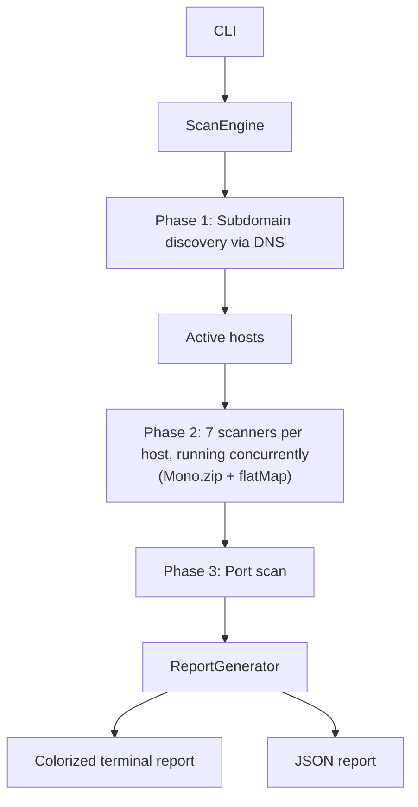

# 🔐 WebSec Scanner

[](https://github.com/akaPierre/websec-scanner/actions/workflows/ci.yml)
[](LICENSE)
[](https://openjdk.org/projects/jdk/21/)

🇺🇸 English | **[🇧🇷 Ler em Português](README.pt-BR.md)**

An educational web application vulnerability scanner.

> ⚠️ **Use only against systems you have explicit authorization to test.**
> Unauthorized use is illegal and unethical.

## 🚀 Features

- 🔍 Subdomain discovery via DNS
- 🛡️ HTTP security header checks
- 🍪 Cookie security flags (Secure, HttpOnly, SameSite)
- 🌐 CORS misconfiguration detection (reflected origin, credentials)
- 🔑 JWT weak-algorithm detection (`alg: none`)
- ↪️ Open redirect probing
- 🔒 HTTPS and SSL certificate analysis
- 🚪 Sensitive port scanning (TCP)
- 📂 Exposed endpoint detection
- 🧬 Technology fingerprinting
- ☠️ Basic subdomain takeover detection
- 📊 JSON report + colorized terminal output

## 🏗️ Architecture



The whole scan pipeline is built on Project Reactor and never blocks a thread waiting on I/O: every scanner returns a `Mono<List<Finding>>`, the 7 per-host scanners (headers, HTTP/SSL, endpoints, fingerprinting, CORS, JWT, open redirect) run concurrently via `Mono.zip`, and multiple hosts are scanned concurrently via `flatMap`. Genuinely blocking work — raw `Socket` connects in `PortScanner`, DNS resolution in `SubdomainScanner` — is bridged into the pipeline through `Schedulers.boundedElastic()` rather than pretending it's asynchronous.

## 🎯 Design decisions

- **Fully non-blocking pipeline.** No scanner calls `.block()` internally; composition happens through Reactor operators all the way up to a single `.block()` at the CLI boundary. This lets dozens of HTTP probes and DNS lookups run concurrently per scan without a thread-per-connection cost.
- **TCP-connect port scanning, not raw sockets.** `PortScanner` uses a plain `Socket` connect against a fixed list of commonly-misconfigured ports. This needs no elevated privileges and runs identically on any OS — a deliberate trade-off against a full SYN scan's stealth and speed, which isn't the goal of an authorized, consent-based tool anyway.
- **Every active check is observational, not exploitative.** The CORS, JWT and open-redirect checks send a single crafted request and read the response — they never follow a redirect, submit credentials, or attempt to forge a token. The scanner is meant to *find* a misconfiguration, not use it.
- **Deliberate concurrency limits.** Per-host and per-scanner concurrency caps exist to keep the tool from hammering a target — the point is authorized reconnaissance, not a load test.

## ⚠️ Known limitations

- Subdomain discovery is wordlist-based (`wordlists/subdomains.txt`) — it won't find subdomains outside that list, and doesn't attempt zone transfers or certificate-transparency lookups.
- Port scanning checks a fixed list of commonly-sensitive ports, not a full 1–65535 sweep.
- JWT detection is passive: it only inspects tokens the server already sets in cookies, and only flags `alg: none`. It doesn't test `Authorization` headers or attempt algorithm-confusion attacks.
- There's no authenticated scanning — every check runs as an anonymous visitor, so anything behind a login form is out of reach.
- `--scope`/`--rate-limit` cover host allow-listing and a global request rate, but not a per-program identifying `User-Agent` (some bounty programs require your researcher handle/contact in it) or a report exporter matching a specific platform's submission template — both would need to be added before this replaces a purpose-built bounty toolkit.

## 🧱 Stack

- Java 21
- Spring Boot 3.5.12
- Maven
- WebFlux (WebClient)
- dnsjava

## ⚙️ Prerequisites

```bash
java -version   # Java 21+
mvn -version    # Maven 3.9+
```

## 🏃 Running it

```bash
# Clone the repository
git clone https://github.com/akaPierre/websec-scanner.git
cd websec-scanner

# Build
mvn clean package -DskipTests

# Interactive mode
java -jar target/websec-scanner-1.0.0.jar

# Direct mode
java -jar target/websec-scanner-1.0.0.jar scanme.nmap.org

# Or via script
chmod +x run.sh
./run.sh scanme.nmap.org
```

### Scoped scans (e.g. bug bounty programs)

Direct mode accepts two extra flags, meant for scanning inside a bounty program's declared scope and rate limit rather than a single ad-hoc domain:

```bash
java -jar target/websec-scanner-1.0.0.jar example.com --scope scope.txt --rate-limit 2
```

The scope file is one rule per line — see [scope.example.txt](scope.example.txt) for a ready-to-copy template. A `!` prefix excludes a host even if another rule allows it.

`--rate-limit 2` caps the scanner at 2 requests/second overall — set it to whatever the program's policy states. Without `--scope`, the tool behaves exactly as before (unrestricted to the single domain given). See [Known limitations](#-known-limitations) below for what this does *not* cover yet (per-program User-Agent, HackerOne report export).

## 🐳 Running with Docker

```bash
docker build -t websec-scanner .
docker run --rm -v "$(pwd)/reports:/app/reports" websec-scanner scanme.nmap.org
```

## 🧪 Tests

```bash
./mvnw test
```

Scanner modules are covered with [MockWebServer](https://github.com/square/okhttp/tree/master/mockwebserver)-backed unit tests (`src/test/java/com/websec/scanner/scanner`).

## 📊 Report structure

```json
{
  "domain": "example.com",
  "scannedAt": "2026-03-23 21:00:00",
  "scanDuration": "12.4s",
  "totalFindings": 7,
  "summary": {
    "high": 2,
    "medium": 3,
    "low": 1,
    "info": 1
  },
  "findings": [
    {
      "type": "HEADER",
      "severity": "HIGH",
      "title": "Missing security header: Content-Security-Policy",
      "description": "...",
      "evidence": "...",
      "recommendation": "...",
      "target": "https://example.com"
    }
  ]
}
```

## 📁 Project structure

```
websec-scanner/
├── src/main/java/com/websec/scanner/
│   ├── cli/           # CLI interface
│   ├── engine/        # Scan orchestrator
│   ├── scanner/       # Analysis modules
│   ├── model/         # POJOs and enums
│   ├── report/        # Report generation
│   └── config/        # Configuration
└── src/main/resources/
    ├── application.properties
    └── wordlists/     # Subdomains and endpoints
```

## 📜 License

MIT — for educational purposes only. See [LICENSE](LICENSE).
