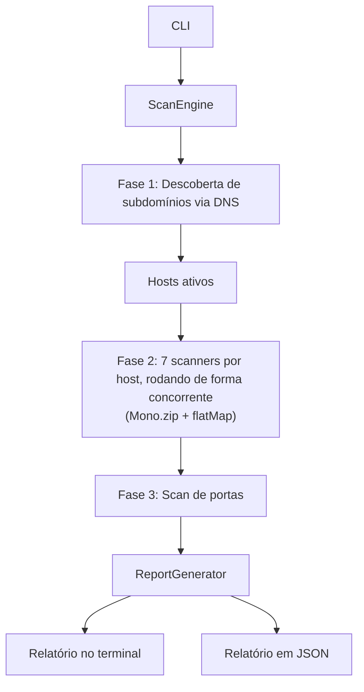

# 🔐 WebSec Scanner

[](https://github.com/akaPierre/websec-scanner/actions/workflows/ci.yml)
[](LICENSE)
[](https://openjdk.org/projects/jdk/21/)

**[🇺🇸 Read in English](README.md)** | 🇧🇷 Português

Ferramenta educativa de análise de vulnerabilidades para aplicações web.

> ⚠️ **Use apenas em sistemas que você possui autorização explícita para testar.**
> O uso não autorizado é ilegal e antiético.

## 🚀 Funcionalidades

- 🔍 Descoberta de subdomínios via DNS
- 🛡️ Verificação de headers de segurança HTTP
- 🍪 Verificação de flags de segurança de cookies (Secure, HttpOnly, SameSite)
- 🌐 Detecção de CORS mal configurado (origem refletida, credenciais)
- 🔑 Detecção de JWT com algoritmo fraco (`alg: none`)
- ↪️ Detecção de possível open redirect
- 🔒 Análise de HTTPS e certificado SSL
- 🚪 Scan de portas sensíveis (TCP)
- 📂 Detecção de endpoints expostos
- 🧬 Fingerprinting de tecnologias
- ☠️ Detecção básica de subdomain takeover
- 📊 Relatório em JSON + terminal colorido

## 🏗️ Arquitetura



Todo o pipeline de scan é construído sobre o Project Reactor e nunca bloqueia uma thread esperando I/O: cada scanner retorna um `Mono<List<Finding>>`, os 7 scanners por host (headers, HTTP/SSL, endpoints, fingerprinting, CORS, JWT, open redirect) rodam concorrentemente via `Mono.zip`, e múltiplos hosts são escaneados concorrentemente via `flatMap`. Operações genuinamente bloqueantes — conexões `Socket` brutas no `PortScanner`, resolução DNS no `SubdomainScanner` — são conectadas ao pipeline via `Schedulers.boundedElastic()` em vez de fingir que são assíncronas.

## 🎯 Decisões de design

- **Pipeline totalmente não-bloqueante.** Nenhum scanner chama `.block()` internamente; a composição acontece por meio de operadores do Reactor até um único `.block()` no limite da CLI. Isso permite que dezenas de sondagens HTTP e consultas DNS rodem concorrentemente em cada scan sem o custo de uma thread por conexão.
- **Scan de portas via TCP-connect, não sockets brutos.** O `PortScanner` usa um `Socket` comum para conectar a uma lista fixa de portas frequentemente mal configuradas. Isso não exige privilégios elevados e roda igual em qualquer sistema operacional — uma troca deliberada da furtividade e velocidade de um SYN scan completo, que de qualquer forma não é o objetivo de uma ferramenta de uso autorizado e consentido.
- **Toda verificação ativa é observacional, não exploratória.** As verificações de CORS, JWT e open redirect enviam uma única requisição elaborada e leem a resposta — nunca seguem um redirecionamento, enviam credenciais ou tentam forjar um token. O objetivo do scanner é *encontrar* uma configuração incorreta, não explorá-la.
- **Limites de concorrência deliberados.** Os limites de concorrência por host e por scanner existem para evitar sobrecarregar o alvo — o objetivo é reconhecimento autorizado, não um teste de carga.

## ⚠️ Limitações conhecidas

- A descoberta de subdomínios é baseada em wordlist (`wordlists/subdomains.txt`) — não encontra subdomínios fora dessa lista, nem tenta zone transfers ou consultas de certificate transparency.
- O scan de portas verifica uma lista fixa de portas comumente sensíveis, não uma varredura completa de 1 a 65535.
- A detecção de JWT é passiva: só inspeciona tokens que o servidor já define em cookies, e só sinaliza `alg: none`. Não testa headers `Authorization` nem tenta ataques de confusão de algoritmo.
- Não há scan autenticado — todas as verificações rodam como um visitante anônimo, então qualquer coisa atrás de um formulário de login está fora de alcance.

## 🧱 Stack

- Java 21
- Spring Boot 3.5.12
- Maven
- WebFlux (WebClient)
- dnsjava

## ⚙️ Pré-requisitos

```bash
java -version   # Java 21+
mvn -version    # Maven 3.9+
```

## 🏃 Como executar

```bash
# Clone o repositório
git clone https://github.com/akaPierre/websec-scanner.git
cd websec-scanner

# Build
mvn clean package -DskipTests

# Modo interativo
java -jar target/websec-scanner-1.0.0.jar

# Modo direto
java -jar target/websec-scanner-1.0.0.jar scanme.nmap.org

# Ou via script
chmod +x run.sh
./run.sh scanme.nmap.org
```

## 🐳 Executar com Docker

```bash
docker build -t websec-scanner .
docker run --rm -v "$(pwd)/reports:/app/reports" websec-scanner scanme.nmap.org
```

## 🧪 Testes

```bash
./mvnw test
```

Os módulos de scanner são cobertos por testes unitários com [MockWebServer](https://github.com/square/okhttp/tree/master/mockwebserver) (`src/test/java/com/websec/scanner/scanner`).

## 📊 Estrutura do Relatório

```json
{
  "domain": "example.com",
  "scannedAt": "2026-03-23 21:00:00",
  "scanDuration": "12.4s",
  "totalFindings": 7,
  "summary": {
    "high": 2,
    "medium": 3,
    "low": 1,
    "info": 1
  },
  "findings": [
    {
      "type": "HEADER",
      "severity": "HIGH",
      "title": "Header de segurança ausente: Content-Security-Policy",
      "description": "...",
      "evidence": "...",
      "recommendation": "...",
      "target": "https://example.com"
    }
  ]
}
```

## 📁 Estrutura do Projeto

```
websec-scanner/
├── src/main/java/com/websec/scanner/
│   ├── cli/           # Interface CLI
│   ├── engine/        # Orquestrador do scan
│   ├── scanner/       # Módulos de análise
│   ├── model/         # POJOs e enums
│   ├── report/        # Geração de relatório
│   └── config/        # Configurações
└── src/main/resources/
    ├── application.properties
    └── wordlists/     # Subdomínios e endpoints
```

## 📜 Licença

MIT — apenas para fins educacionais. Veja [LICENSE](LICENSE).
